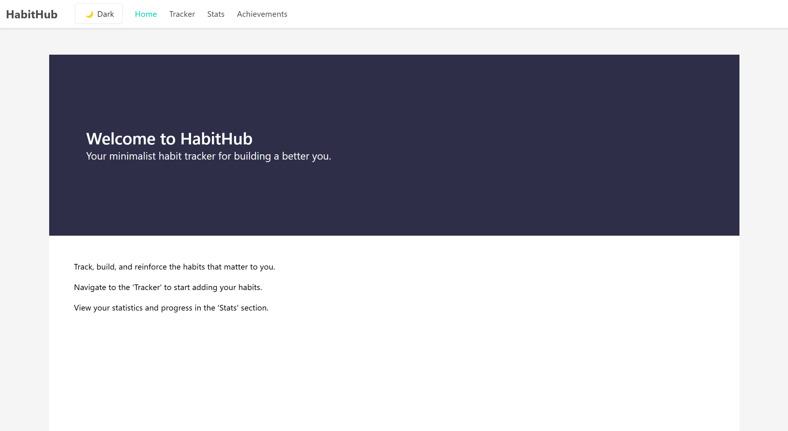
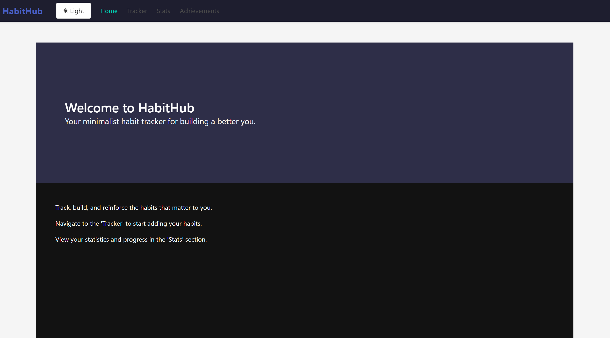
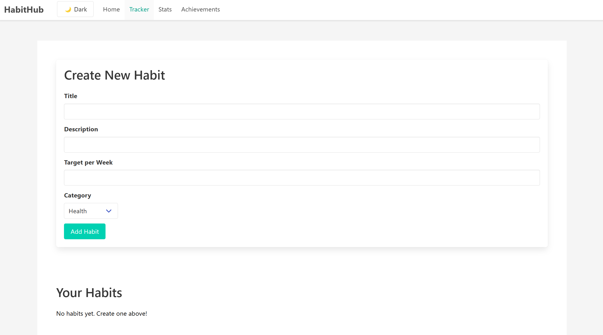
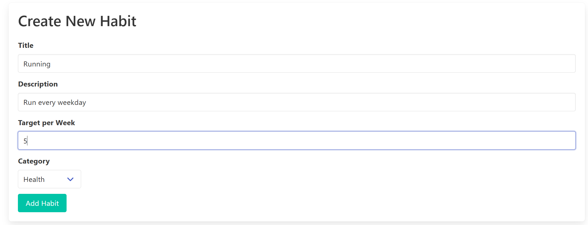
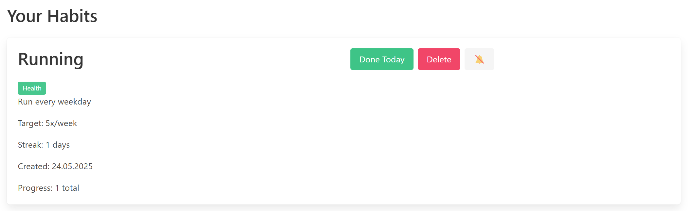
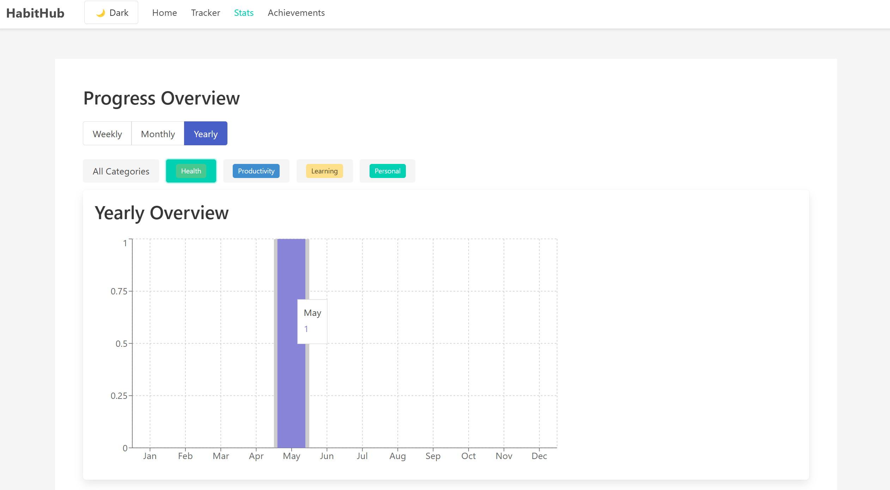
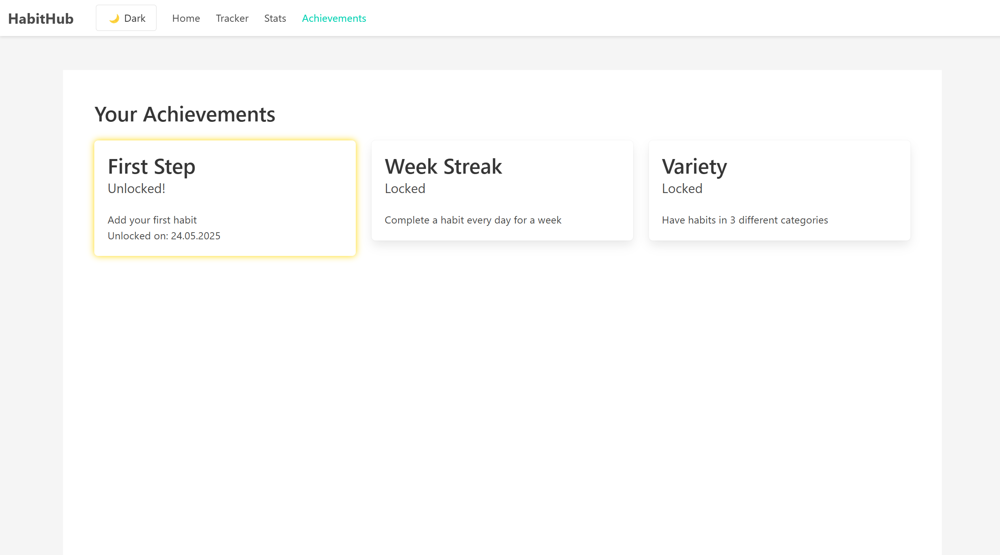

# HabitHub 🌱

A sleek and simple web app to build — and keep — healthy habits.  
Track your routines, stay consistent, and watch your progress grow, day by day.

Built entirely in the browser using **F#**, **Fable**, and **Elmish**.

👉 [Try it live](https://annapolovkova.github.io/habit-hub-project/)

---

## ✨ Motivation

As a student balancing studies, hobbies, and health, staying consistent is hard — especially when life gets chaotic.  
I wanted a tool that doesn’t just remind me of goals, but makes tracking **simple**, **visual**, and even a little fun.

**HabitHub** was born from that need — distraction-free space to monitor your daily habits and celebrate progress.


This is a project which I am still working on.

---

## Features

- ✅ Add and track **daily habits**
- 🎨 Assign **categories** to group habits
- 📆 See your **daily progress** in a calendar-like layout
- 🌙 Built-in **dark mode**
- 🔄 Automatically **saves your data** in your browser
- 📊 Get **achievements**
---

## 🖼️ Screenshots

### 🗓️ First Page
See a Meeting Page with some information about web-site 


---

### 🌗 Dark Mode
Change the style of web-page to dark or lihgt


---

### ➕ Add Habit  
Create habits with custom titles, descriptions and categories



---

### 🎨 Habits 
See all your habits and 
Push button to submit that you followed habit today


---

### 🗓️ Overview
Overview of all your habits for the week, month or year by categories  


---

### ➕ Achievements
Get different Achievements for your work


---

## 🛠️ Tech Stack

- **F#** — functional programming on .NET
- **Fable** — F# to JavaScript compiler
- **Elmish** — Elm architecture in F#

---

## 📚 About

Developed as a semester project (Project Beta)  
for the Functional Programming with F# course at the University of Dunaújváros, Hungary.

Instructor: Adam Granicz, IntelliFactory

---

## 📦 Getting Started

```bash
git clone https://github.com/AnnaPolovkova/habit-hub-project.git
cd habit-hub-project
npm install
npm start
